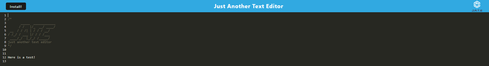

# bromaritos-text-editor
Here's a simple text editor app that will save your entries. On refresh, it will display the last entry you had.

## Technology
It uses:
* IndexedDB
* idb
* webpack
* workbox

## What was the point?
The point of this application is to provide a Text Editor PWA. For me, it was to get a bit more practice in with webpack and creating a PWA. Along with that, it was also a good exercise in caching and using IndexedDB.

## Deployed Link
Find the deployed application <a href="https://aqueous-sierra-88477.herokuapp.com/">HERE<a/>

## Screenshots
